PROJET DEVOPS - Orchestration

1) Introduction
La société IC GROUP souhaite mettre en place un site web vitrine pour accéder à ses 02 applications phares :

Odoo - Un ERP permettant de gérer plusieurs aspects de l'entreprise comme les ventes, la comptabilité, les achats, etc.

pgAdmin - Un outil d'administration de bases de données PostgreSQL.

Le but de ce projet est de conteneuriser ces deux applications et de déployer l'ensemble dans un cluster Kubernetes.

2) Prérequis
Outils à installer
Avant de commencer, tu dois installer les outils suivants sur ton système :

Docker : Pour créer des images et gérer des containers.

Minikube : Pour créer un cluster Kubernetes local.

kubectl : Pour interagir avec le cluster Kubernetes.

📅 Etapes du projet

Installation des outils de base

Installation de docker

Installation de git et Installation de kubectl

Installation de minikube + configuration du fichier Dockerfile

Je créé un fichier requirements.txt avec nano.
 C’est pour que Docker installe cette version précise de Flask dans mon image.

 docker build -t ic-webapp:1.0 .
J’ai construit une image Docker depuis le Dockerfile de mon dossier courant (.).
Je lui ai donné le nom ic-webapp et le tag 1.0.

👉 À la fin, j’obtiens une image locale prête à être testée ou poussée.

🧱 docker tag ic-webapp:1.0 adam2696/ic-webapp:1.0
J’ai "renommé" l’image avec un tag Docker Hub pour pouvoir la pousser en ligne.
adam2696 c’est mon identifiant Docker Hub.

👉 C’est une exigence pour pouvoir la publier sur mon Docker Hub.

🧱 docker login -u adam2696
Je me suis connecté à Docker Hub avec mon identifiant.

🧱 docker push adam2696/ic-webapp:1.0
J’ai envoyé mon image Docker vers Docker Hub.
✅ L’image est maintenant disponible en ligne.

🧱 minikube start --driver=docker
J’ai lancé un cluster Kubernetes local avec Minikube en utilisant Docker comme moteur.

🧱 kubectl create namespace icgroup
J’ai créé un namespace Kubernetes nommé icgroup pour isoler mes ressources.

🧱 kubectl label namespace icgroup env=prod
J’ai ajouté un label env=prod à ce namespace (pratique pour l'organisation).

🧱 kubectl apply -f ic-webapp-deployment.yaml -n icgroup
J’ai déployé mon application (Deployment + Service) dans le namespace icgroup.

Vérfication de la création de l'image sur DockerHub
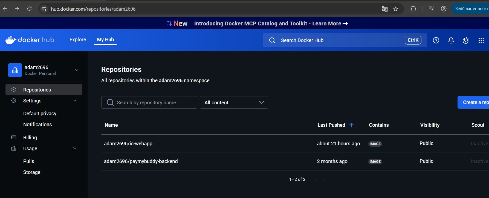

Exposer un service Kubernetes

La commande kubectl expose permet de rendre un déploiement accessible depuis l'extérieur du cluster Kubernetes. Elle expose le déploiement sous forme de service et spécifie le type de service (ici NodePort) ainsi que le port sur lequel il doit être accessible.

Vérifier les services

La commande kubectl get services -n icgroup liste les services actifs dans le namespace icgroup. Cela permet de vérifier les adresses IP internes, les ports attribués ainsi que les types de services (ici NodePort), ce qui te permet de savoir comment accéder à chaque service.

Accéder à un service via Minikube

La commande minikube service ouvre un service spécifique dans ton navigateur. Elle utilise l'adresse IP du cluster local Minikube et le port exposé du service pour te permettre d'accéder à ton application web via une URL locale.

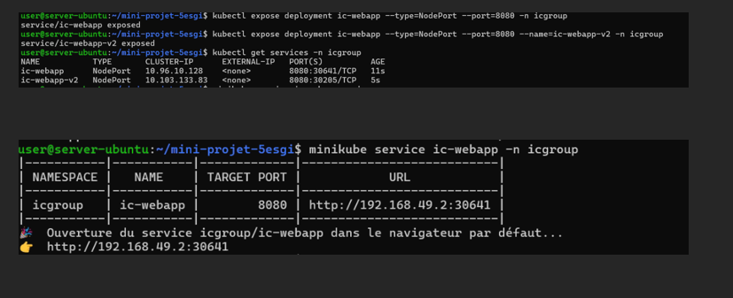

kubectl get pods -n icgroup : Liste les pods dans le namespace icgroup et vérifie leur état.

Création du Service : Le fichier YAML expose l'application via un service NodePort, accessible sur un port externe (30641).

kubectl apply -f ic-webapp-service.yaml : Applique la configuration du service pour exposer l'app dans le cluster.

kubectl describe svc ic-webapp -n icgroup : Donne des détails sur le service, comme son port externe et ses endpoints.

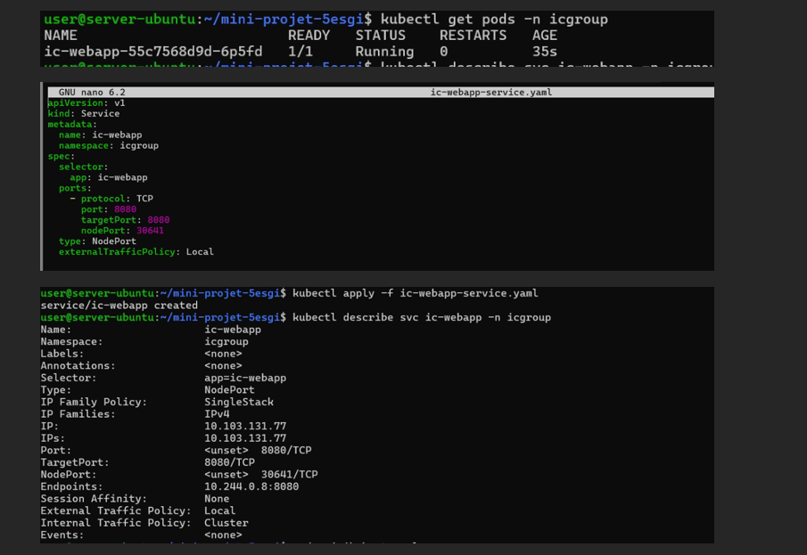

Création du fichier ic-wobapp-doploymont.yaml
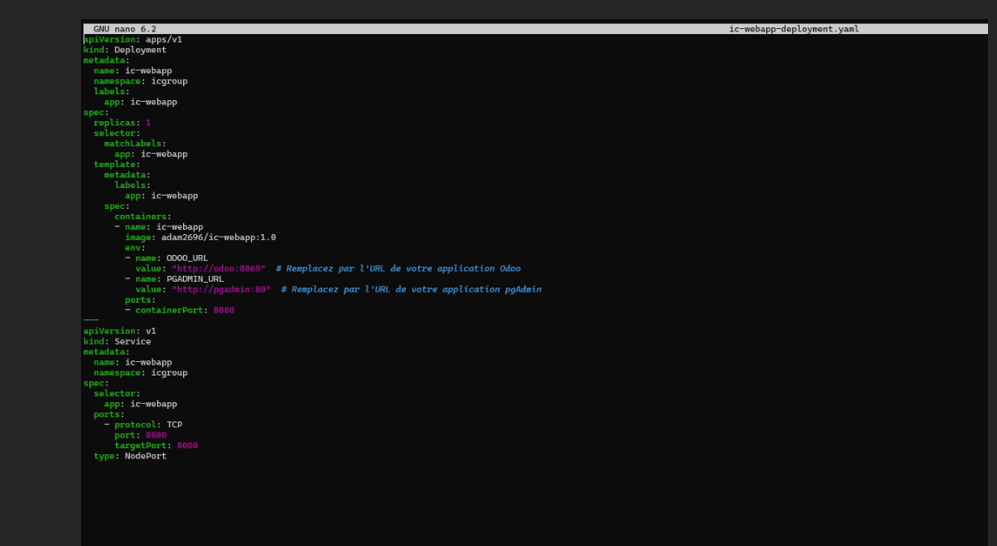

Création du fichier configurer les paramètres de l' instance Odoo Ce fichier est essentiel pour l'initialisation et la configuration d'Odoo
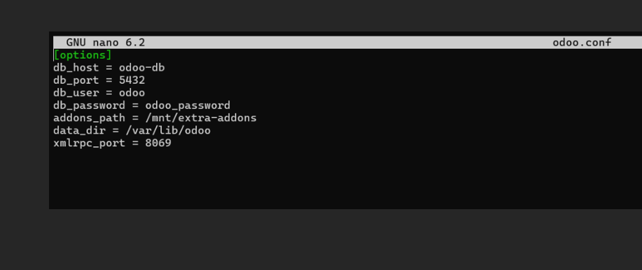

Création du fichier odoo-deploymont.yaml
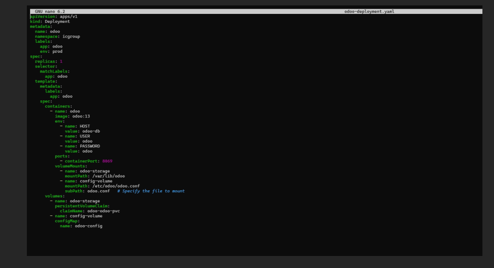

Création du fichier odoo-db-doploymont.yaml
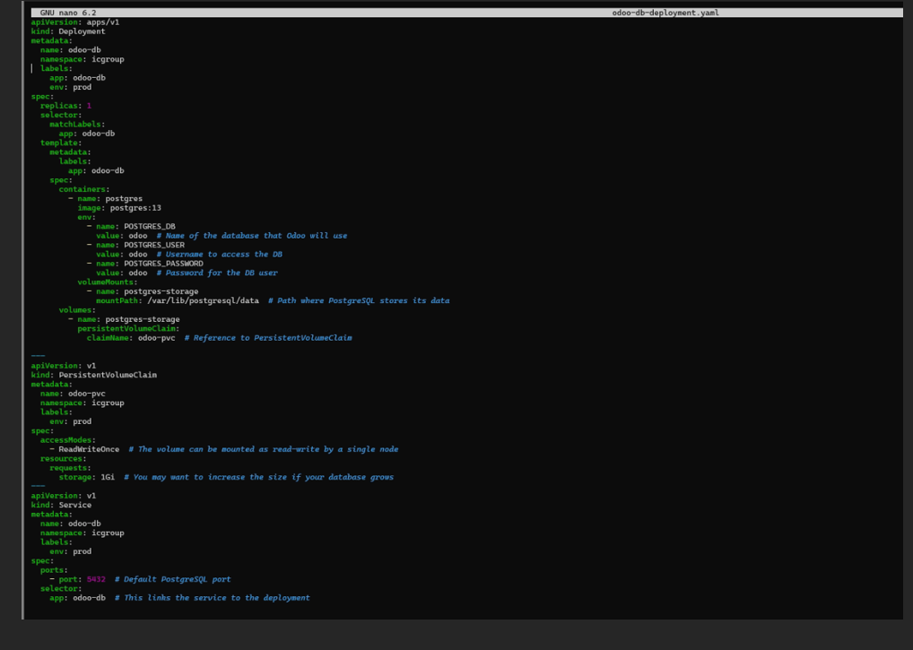

Création du fichier pgadmin-deployment.yaml
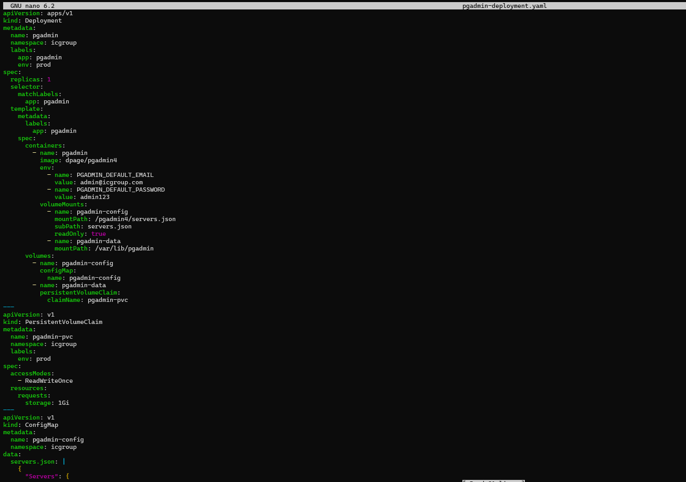
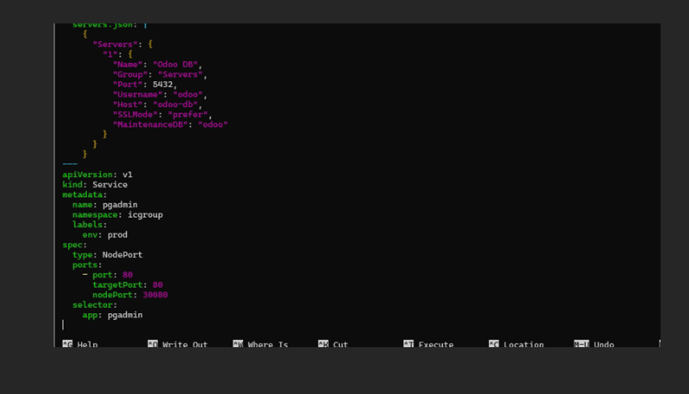

La commande kubectl create configmap permet de créer un ConfigMap dans Kubernetes, qui est un objet utilisé pour stocker des données de configuration sous forme de paires clé-valeur.
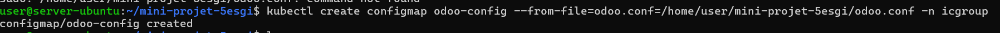

Les commandes que tu as exécutées appliquent des fichiers de configuration Kubernetes pour déployer Odoo, la base de données PostgreSQL, pgAdmin et ton application web dans le namespace icgroup. Ensuite, kubectl get all liste tous les pods, services et déploiements créés. Les services sont exposés sur des ports spécifiques, comme 8080:30641/TCP pour ic-webapp. Tout est en Running et prêt à fonctionner, sans IP externe définie pour l'accès direct.
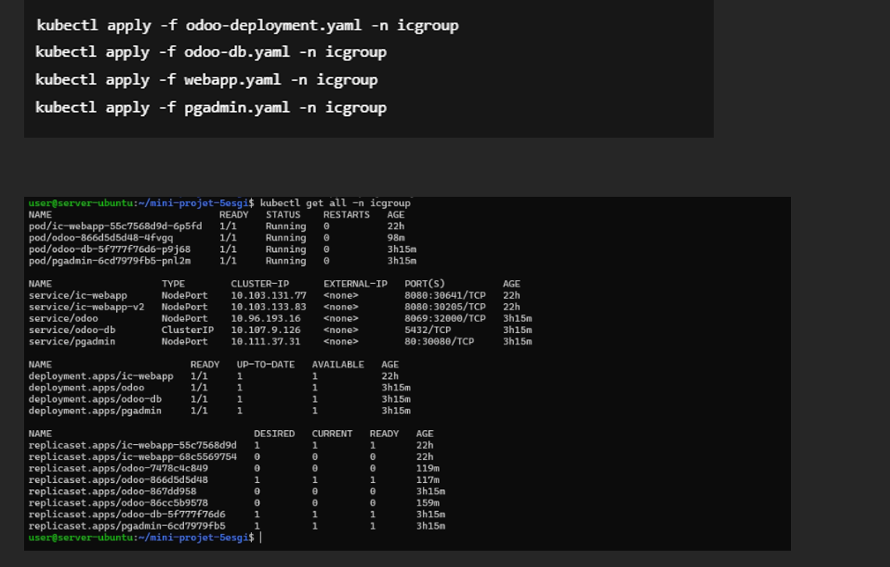

L'erreur OSError: [Errno 98] Address already in use indique que le port que Odoo tente d'utiliser (probablement le port 8069) est déjà occupé par un autre processus. Pour résoudre cela :

Vérification des processus : Tu as identifié et tué un processus avec kill (ID 75344).

Redémarrage du Pod Kubernetes : Pour forcer la réinitialisation de l'application, utilise kubectl delete pod afin de tuer le pod et permettre à Kubernetes de le redémarrer sans conflit de port.

Vérification des logs : Utilise kubectl logs pour vérifier les logs du pod et diagnostiquer d'autres problèmes.

Cela permet de résoudre un conflit de port et relancer Odoo proprement.

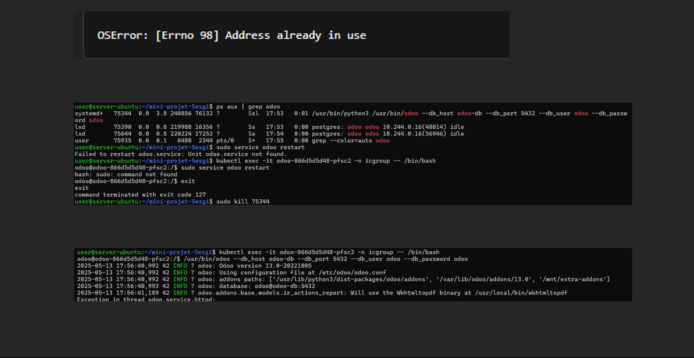

L'exécution de la commande kubectl logs odoo-866d5d5d48-4fvgq -n icgroup montre que le pod Odoo démarre correctement. Voici une explication de ce que les logs révèlent :

Configuration : Odoo utilise le fichier de configuration situé à /etc/odoo/odoo.conf.

Base de données : Il se connecte à la base de données PostgreSQL via odoo-db sur le port 5432.

Modules : Odoo charge plusieurs modules sans erreur.

Service HTTP : Le service HTTP d'Odoo (Werkzeug) tourne sur le port 8069 du pod Odoo.

Ensuite, avec kubectl get pods --all-namespaces -o wide, tu vérifies l'état de tous les pods Kubernetes dans tous les namespaces. Tous les pods (y compris Odoo, Odoo DB, etc.) sont "Running" et sont associés à l'adresse IP 10.244.x.x sur le cluster Kubernetes.

Cela indique que tous les services sont actifs et fonctionnent correctement dans le cluster.

minikube service ic-webapp -n icgroup
Cette commande ouvre le service ic-webapp sur ton navigateur à l'adresse http://192.168.49.2:30641. Ce service est exposé via un NodePort sur le port 30641.

minikube service ic-webapp-v2 -n icgroup
Elle ouvre le service ic-webapp-v2 à l'adresse http://192.168.49.2:30205, exposé via le port 30205 grâce à NodePort.

minikube service odoo -n icgroup
Elle ouvre le service odoo sur le navigateur à http://192.168.49.2:32000, exposé via NodePort sur le port 32000.

minikube service pgadmin -n icgroup
Elle ouvre le service pgadmin à l'adresse http://192.168.49.2:30080, exposé via NodePort sur le port 30080.

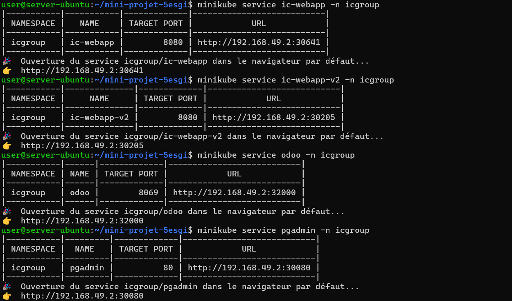

La commande ssh -L crée des tunnels SSH pour rediriger des ports locaux vers des ports distants. Cela permet d'accéder à des services sur la machine distante via des ports locaux sur ta machine. Ici, tu rediriges plusieurs services Minikube (comme ic-webapp, odoo, etc.) de l'adresse 192.168.49.2 vers ton ordinateur local à travers des ports comme 31000, 31001, etc.

TEST:
ACCES AU SITE IC GROUP
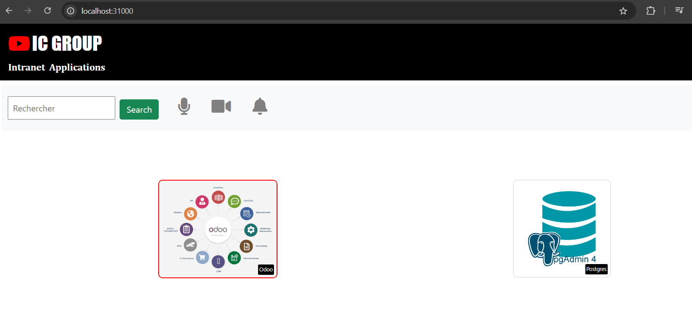
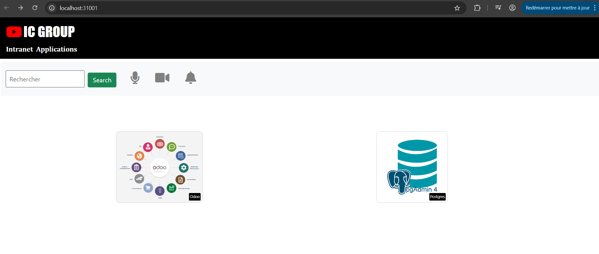

ACCES PG ADMIN
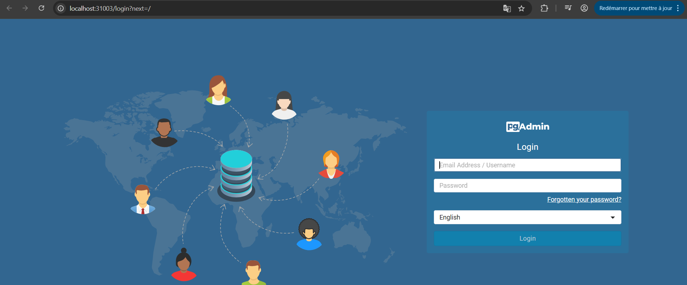
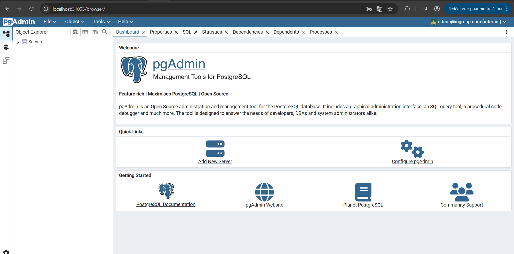

ACCES ODOO
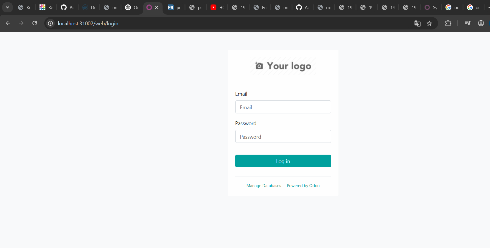
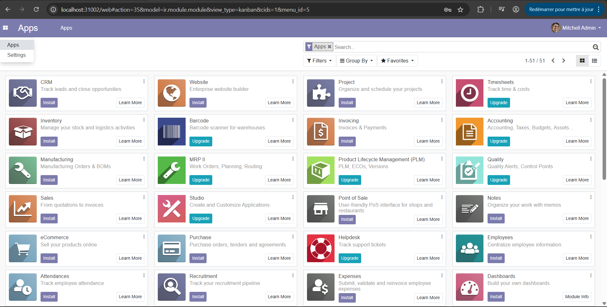

PROJET TERMINER
