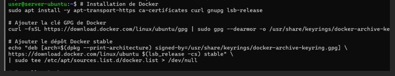
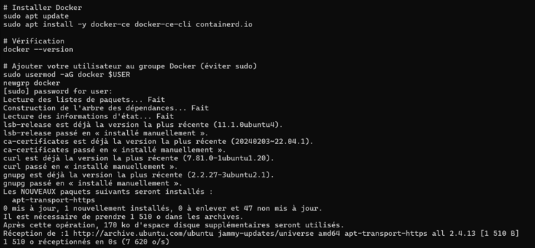
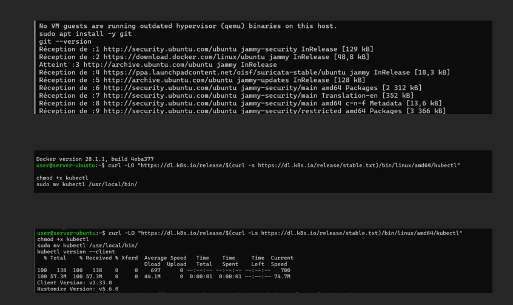
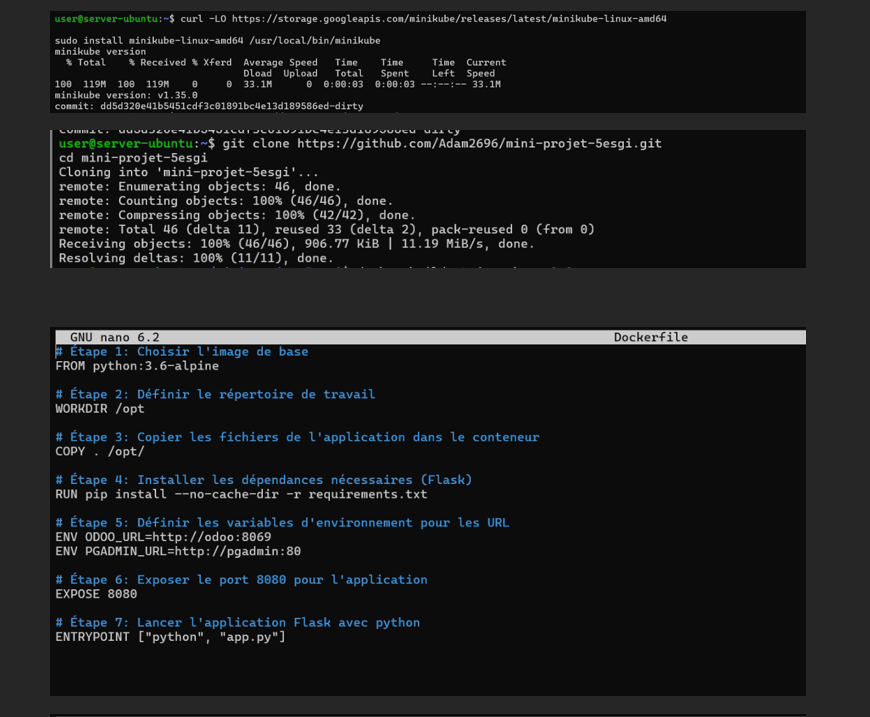
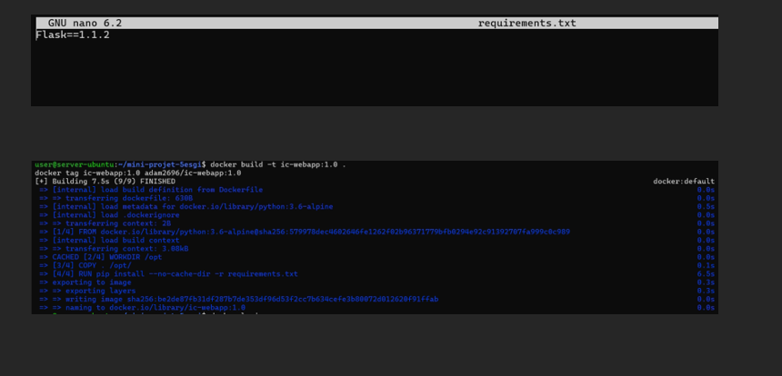
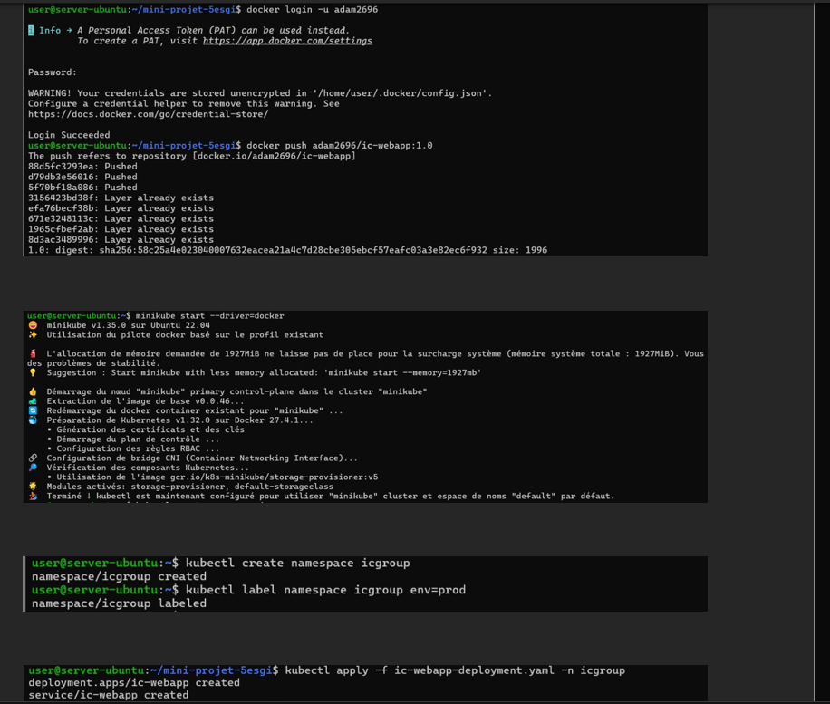

PROJET DEVOPS - Orchestration

1) Introduction
La société IC GROUP souhaite mettre en place un site web vitrine pour accéder à ses 02 applications phares :

Odoo - Un ERP permettant de gérer plusieurs aspects de l'entreprise comme les ventes, la comptabilité, les achats, etc.

pgAdmin - Un outil d'administration de bases de données PostgreSQL.

Le but de ce projet est de conteneuriser ces deux applications et de déployer l'ensemble dans un cluster Kubernetes.

2) Prérequis
Outils à installer
Avant de commencer, tu dois installer les outils suivants sur ton système :

Docker : Pour créer des images et gérer des containers.

Minikube : Pour créer un cluster Kubernetes local.

kubectl : Pour interagir avec le cluster Kubernetes.

📅 Etapes du projet

Installation des outils de base

Installation de docker

Installation de git et Installation de kubectl

Installation de minikube + configuration du fichier Dockerfile

Je créé un fichier requirements.txt avec nano.
 C’est pour que Docker installe cette version précise de Flask dans mon image.

 docker build -t ic-webapp:1.0 .
J’ai construit une image Docker depuis le Dockerfile de mon dossier courant (.).
Je lui ai donné le nom ic-webapp et le tag 1.0.

👉 À la fin, j’obtiens une image locale prête à être testée ou poussée.

🧱 docker tag ic-webapp:1.0 adam2696/ic-webapp:1.0
J’ai "renommé" l’image avec un tag Docker Hub pour pouvoir la pousser en ligne.
adam2696 c’est mon identifiant Docker Hub.

👉 C’est une exigence pour pouvoir la publier sur mon Docker Hub.

🧱 docker login -u adam2696
Je me suis connecté à Docker Hub avec mon identifiant.

🧱 docker push adam2696/ic-webapp:1.0
J’ai envoyé mon image Docker vers Docker Hub.
✅ L’image est maintenant disponible en ligne.

🧱 minikube start --driver=docker
J’ai lancé un cluster Kubernetes local avec Minikube en utilisant Docker comme moteur.

🧱 kubectl create namespace icgroup
J’ai créé un namespace Kubernetes nommé icgroup pour isoler mes ressources.

🧱 kubectl label namespace icgroup env=prod
J’ai ajouté un label env=prod à ce namespace (pratique pour l'organisation).

🧱 kubectl apply -f ic-webapp-deployment.yaml -n icgroup
J’ai déployé mon application (Deployment + Service) dans le namespace icgroup.

